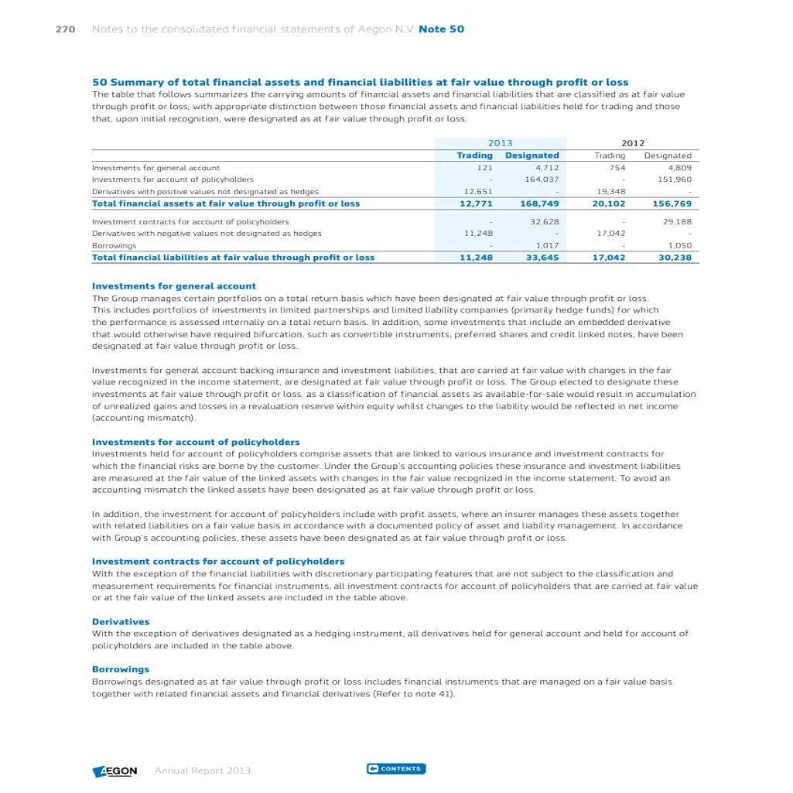
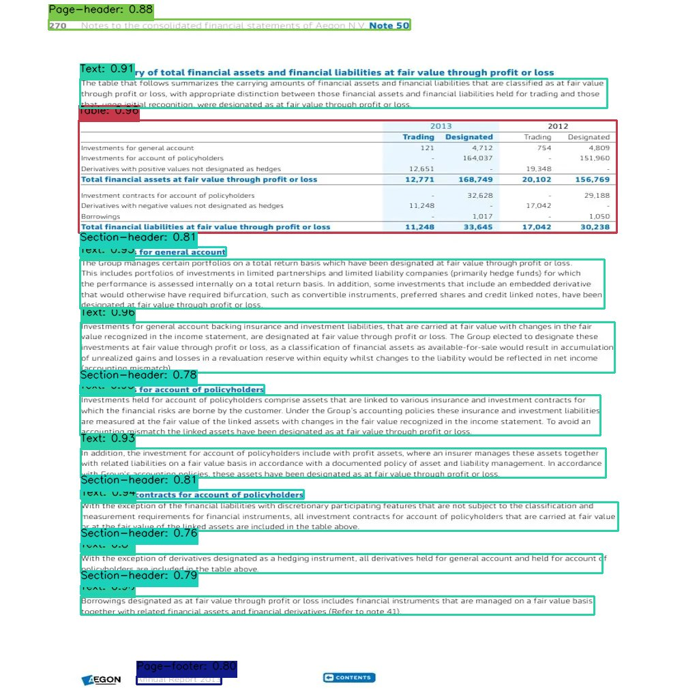

# 📄 DocLayout-YOLO

> **Fine-tuned YOLO model for document page layout detection** — identifies text blocks, tables, headings, figures, footnotes, and more from document images with a lightweight ONNX-exported model.

[](https://python.org)
[](https://onnxruntime.ai)
[](https://github.com/PaddlePaddle/PaddleOCR)
[](https://doclayout-yolo.streamlit.app/)

---

## 🧠 What It Does

DocLayout-YOLO takes a scanned or digital document page image and detects the **semantic layout regions** within it — outputting bounding boxes, confidence scores, and OCR-extracted text for each region.

**Detected classes (11 total):**

| Class            | Description                       |
| ---------------- | --------------------------------- |
| `Title`          | Document or section title         |
| `Section-header` | Sub-section headings              |
| `Text`           | Body text paragraphs              |
| `Table`          | Tabular data regions              |
| `List-item`      | Bulleted or numbered list entries |
| `Caption`        | Figure and table captions         |
| `Page-header`    | Running headers                   |
| `Page-footer`    | Running footers / page numbers    |
| `Footnote`       | Footnote text at page bottom      |
| `Picture`        | Images, figures, charts           |
| `Formula`        | Mathematical expressions          |

### Example Output

| Input Document                      | Detected Layout                   |
| ----------------------------------- | --------------------------------- |
|  |  |

---

## 🗂️ Project Structure

```
doclayout-yolo/
├── app.py                      # Streamlit demo app
├── config/
│   └── metadata.yaml           # Class name mapping
├── examples/
│   ├── singleDocImg.png        # Sample input image
│   └── output4.json            # Sample JSON output
├── layout_detector/
│   ├── __init__.py
│   ├── detector.py             # DetectFunction class (YOLO inference)
│   ├── session.py              # ONNX Runtime session factory
│   └── utils.py                # OCR extraction + JSON builder
├── scripts/
│   └── run_detection.py        # CLI inference script
├── requirements.txt
└── README.md
```

---

## ⚙️ Installation

```bash
git clone https://github.com/chirag4862/doclayout-yolo.git
cd doclayout-yolo
pip install -r requirements.txt
```

> **PaddlePaddle note:** For GPU support, replace `paddlepaddle` with the CUDA variant from the [PaddlePaddle install guide](https://www.paddlepaddle.org.cn/install/quick).

### Download Model Weights

The `best.onnx` model weights are not stored in this repo due to file size. Download from the [Releases page](https://github.com/chirag4862/doclayout-yolo/releases/) and place in the project root:

```
doclayout-yolo/
└── best.onnx   ← place here
```

**For local use (full features including OCR):**

```bash
pip install -r requirements-local.txt
```

**For deployment / no OCR:**

```bash
pip install -r requirements.txt
```

---

## 🚀 Usage

### Streamlit App (recommended)

```bash
streamlit run app.py
```

Open `http://localhost:8501`, upload any document image, and get instant layout detection with optional OCR extraction.

### CLI Script

```bash
python scripts/run_detection.py \
    --image examples/singleDocImg.png \
    --output outputs/result.json \
    --save-image outputs/annotated.png
```

**All CLI options:**

| Flag           | Default                | Description                           |
| -------------- | ---------------------- | ------------------------------------- |
| `--image`      | _(required)_           | Path to input document image          |
| `--model`      | `best.onnx`            | Path to ONNX weights                  |
| `--classes`    | `config/metadata.yaml` | Class mapping YAML                    |
| `--output`     | `outputs/result.json`  | JSON output path                      |
| `--save-image` | `None`                 | Save annotated image (optional)       |
| `--conf`       | `0.4`                  | Confidence threshold                  |
| `--iou`        | `0.4`                  | IoU threshold for NMS                 |
| `--no-ocr`     | `False`                | Skip OCR (faster, no text extraction) |

### Python API

```python
import cv2
from layout_detector import DetectFunction, create_session, build_output_structure

# Load image
image = cv2.imread("examples/singleDocImg.png")
h, w = image.shape[:2]

# Init session and detector
session_args = create_session("best.onnx", "config/metadata.yaml")
detector = DetectFunction(
    model_path="best.onnx",
    class_mapping_path="config/metadata.yaml",
    original_size=(w, h),
)

# Detect layout regions
detections = detector.detect(image, session_args)

# Optional: run OCR on each region
from paddleocr import PaddleOCR
ocr = PaddleOCR(use_angle_cls=True, lang="en", use_gpu=False)
structured = build_output_structure(image, "doc.png", detections, ocr)

# structured is a dict: { "Text": [...], "Table": [...], ... }
for class_name, regions in structured.items():
    for region in regions:
        print(class_name, region["coordinates"], region["text"])
```

### Sample JSON Output

```json
{
    "Section-header": [
        {
            "coordinates": { "l": 117.0, "t": 362.0, "r": 331.0, "b": 375.0 },
            "accuracy": 80.80,
            "text": "Investments for general account"
        }
    ],
    "Table": [
        {
            "coordinates": { "l": 115.0, "t": 176.0, "r": 904.0, "b": 341.0 },
            "accuracy": 96.35,
            "text": null
        }
    ],
    "Text": [ ... ]
}
```

---

## 🏗️ Model Details

| Property          | Value                            |
| ----------------- | -------------------------------- |
| Architecture      | YOLOv8 (fine-tuned)              |
| Export format     | ONNX v7                          |
| Producer          | PyTorch 1.11.0                   |
| Input             | Variable size (model stride: 32) |
| Inference backend | ONNX Runtime (CPU / CUDA)        |
| OCR backend       | PaddleOCR                        |

The model was fine-tuned on document layout datasets covering financial reports, academic papers, and general structured documents.

---

## 📦 Tech Stack

- **[ONNX Runtime](https://onnxruntime.ai/)** — cross-platform model inference
- **[PaddleOCR](https://github.com/PaddlePaddle/PaddleOCR)** — multilingual OCR for text extraction
- **[OpenCV](https://opencv.org/)** — image I/O and preprocessing
- **[Streamlit](https://streamlit.io/)** — interactive web demo

---

## 🤝 Contributing

Issues and PRs are welcome. If you test this on new document types or improve the model, please share your results!

---

## 📄 License

MIT License — see [LICENSE](LICENSE) for details.
